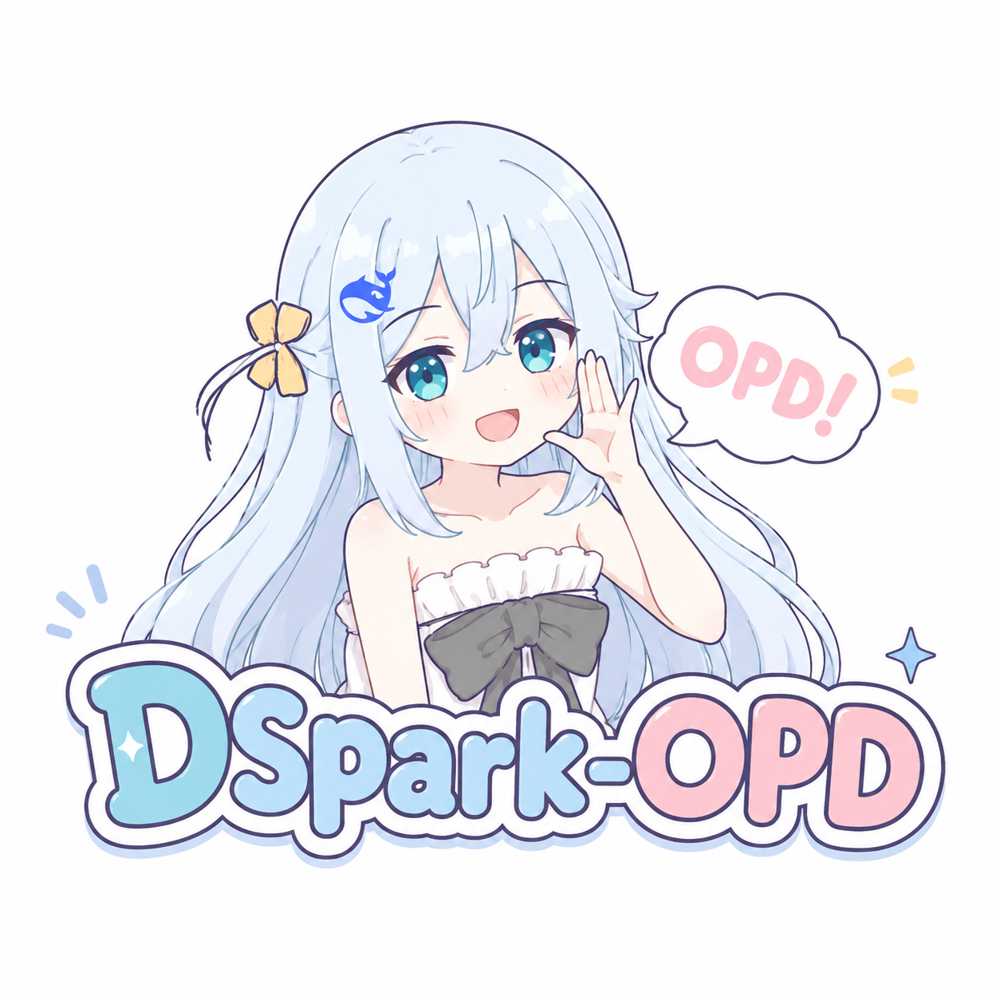

<div align="center">
 

# DSpark-OPD

DSpark-OPD 是一个研究工程，用于将 On-Policy Distillation（OPD，在线策略蒸馏）与 DeepSeek DeepSpec 的 DSpark 草稿模型结合起来。

[](https://www.python.org/)
[](https://opensource.org/licenses/MIT)
[](https://github.com/Palind-Rome/DSpark-OPD)

</div>

> [!CAUTION]
> 期末周搓的，还没来得及细看代码、实验。期末结束后维护。
>
> 请参考本项目的中文博客：[BLOG.zh-CN.md](BLOG.zh-CN.md)

# DSpark-OPD

DSpark-OPD is a research engineering scaffold for combining On-Policy Distillation (OPD) with DeepSeek DeepSpec's DSpark drafter.

The project does not vendor DeepSpec. Instead, it implements the reusable pieces that DSpark needs when moved from offline target-cache training toward online, draft-induced training:

- DSpark supervised objective: CE + TV/L1 + confidence-head BCE.
- OPD losses: full-vocabulary reverse KL, teacher-top-k forward KL, and single-sample KL estimators.
- Draft-OPD-style replay masks for accepted/rejected draft blocks.
- DSpark hardware-aware prefix scheduler and Sequential Temperature Scaling.
- A PyTorch adapter that can be called from a DeepSpec trainer when torch and DeepSpec are available.

## Why This Shape?

Public DeepSpec trains DSpark from cached target trajectories. OPD changes the data distribution: the drafter should be supervised on states induced by its own current policy. For DSpark, that means:

1. Use DSpark/speculative rollout to collect draft anchors and verification outcomes.
2. Replay draft blocks from those anchors.
3. Score the replay states with the frozen target teacher.
4. Add an OPD loss to the original DSpark objective.

DeepSeek-V4's technical report motivates the full-vocabulary path: token-level KL estimators are cheaper but high-variance, while full-logit distillation is more stable when infrastructure can cache teacher hidden states and reconstruct logits on demand.

## Quick Start

```bash
python -m pytest
python scripts/dspark_opd_dry_run.py --config configs/dspark_opd_qwen3_4b.yaml
```

The local smoke tests use numpy. The PyTorch adapter lives in `dspark_opd.torch_losses` and is imported only in environments with torch installed.

## Repository Layout

- `src/dspark_opd/losses.py` - numpy reference implementation of DSpark + OPD losses.
- `src/dspark_opd/torch_losses.py` - DeepSpec-compatible PyTorch adapter.
- `src/dspark_opd/scheduler.py` - DSpark hardware-aware prefix scheduler.
- `src/dspark_opd/calibration.py` - Sequential Temperature Scaling and ECE.
- `src/dspark_opd/replay.py` - replay-block metadata and accepted/rejected masks.
- `docs/research_notes.zh-CN.md` - research notes and design decisions.
- `BLOG.zh-CN.md` - concise Chinese blog.

## DeepSpec Integration Sketch

In `deepspec/trainer/dspark_trainer.py`, the current `run_batch` computes only `compute_dspark_loss(outputs=...)`. A DSpark-OPD trainer would keep that supervised term, then feed replay tensors to:

```python
from dspark_opd.torch_losses import TorchLossConfig, compute_dspark_opd_torch_loss

loss = compute_dspark_opd_torch_loss(
    outputs,
    teacher_logits=replay_teacher_logits,
    replay_mask=replay_mask,
    config=TorchLossConfig(opd_alpha=1.0),
)
```

For production-scale training, the replay producer should reuse DeepSpec's target hidden-state cache idea: cache teacher final hidden states for replay positions, then run the LM head locally for full-vocabulary KL.
